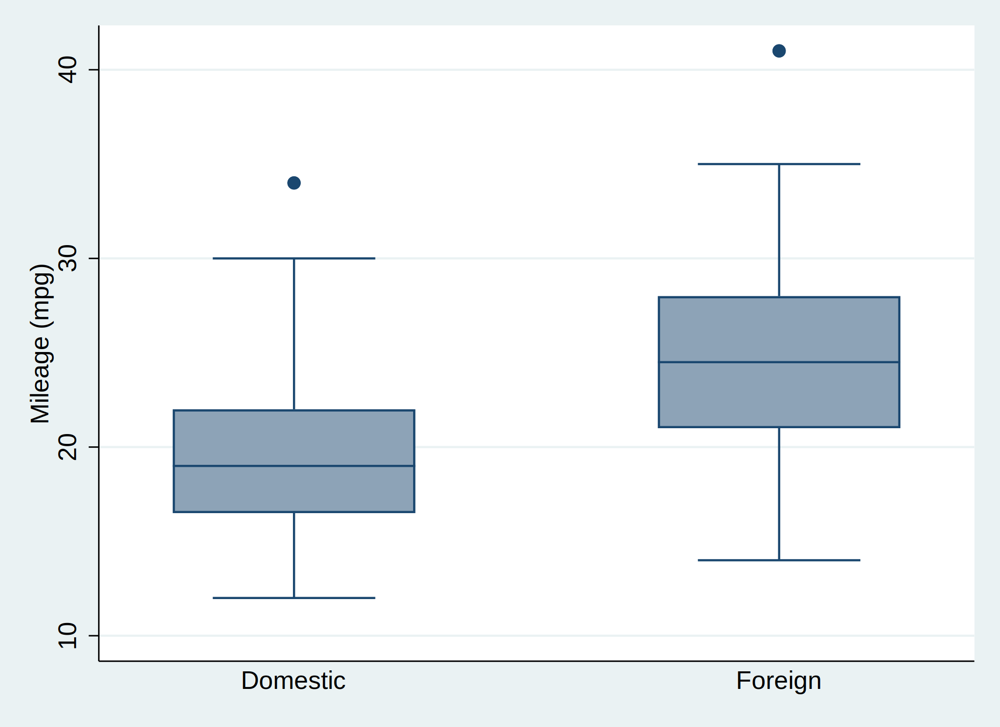

[Stata notes](../stata.html) |
[Stata and R Markdown](../stata.html#stata-and-r-markdown)

> Source: [https://www.ssc.wisc.edu/~hemken/Stataworkshops/Stata%20and%20R%20Markdown/StataMarkdown.rmd](https://www.ssc.wisc.edu/~hemken/Stataworkshops/Stata%20and%20R%20Markdown/StataMarkdown.rmd)

## Introduction
This is an introduction to writing dynamic documents
using R Markdown to produce
documents based on Stata.  This process uses 
Rstudio (or just R) to create documents that depend upon Stata code.
The source for **this** document is [StataMarkdown.rmd](StataMarkdown.rmd)

## Background
*Markdown* is a language for formatting not-too-complicated documents using 
just a few text symbols.  It is designed to be easy to read and write. 
If you read and write email, you are probably already familiar with many
of these formatting conventions.
For more specifics about Markdown see John Gruber\'s
[Markdown article](https://daringfireball.net/projects/markdown/). 

*Dynamic Markdown* has been implemented for a number of programming languages,
including Stata and R.  Within Stata there is a dynamic
markdown package called `stmd` that relies on Stata\'s `dyndoc` command, as well as
the user-written package `markstat`.  Each
has it\'s strengths and weaknesses.  

The system I will describe here is
intended primarily for those of us who are already using R Markdown to
write documentation in other languages, and would like to use this
for Stata as well.

*R Markdown* is a dynamic markdown system that
extends Markdown by allowing you to include blocks of code in one
of several programming languages.  The code is evaluated, and both the
code and it\'s results are included in a Markdown document.  To read
more about the details of R Markdown see RStudio\'s 
[R Markdown webpages](http://rmarkdown.rstudio.com/lesson-1.html)

*RStudio* uses an R package called `knitr` (this could also be called
directly from R), which includes the ability to evaluate Stata.

The documentation for `knitr` can be found in R\'s Help, from 
[Yihui Xie\'s web page](https://yihui.org/knitr/), or in the book,
[*R Markdown: The Definitive Guide*](https://bookdown.org/yihui/rmarkdown/).

Finally, I use some helper functions in a package called
`Statamarkdown`.  While these are not necessary to write dynamic
documents based on Stata, they make life easier.

`Statamarkdown` can be installed from github.com.
```
library(devtools) # before this you may need to install devtools
install_github("hemken/Statamarkdown")
```

> Note, RStudio is a great environment for writing Markdown with
executable R code chunks, but it is 
not a friendly environment for extensively
debugging problems in your Stata code.  If your Stata code
is complicated, you should probably work out the details
in Stata first, then pull it into RStudio to develop
your documentation!

## Setting up the Stata engine

```{r setup, echo=FALSE, message=FALSE}
  library(Statamarkdown)
```

In order to execute your Stata code, `knitr` needs to know where the Stata
executable is located.  This can be done with a preliminary code chunk,
by loading the Statamarkdown package:

    ```{r, echo=FALSE, message=FALSE}`r ''`
    library(Statamarkdown)
    ```
  
(In `knitr` jargon, a block of code is a \"code chunk\".)  

If the package fails to find your copy of Stata (you will see a message),
you may have to
specify this yourself (see [Stata Engine Path](StataEnginePath.html)).

After this setup chunk, subsequent code to be processed by Stata 
can be specified as:

    ```{stata}`r ''`
    
    -- Stata code here --
    
    ```

## Linking Code Blocks
Each block (chunk) of Stata code is executed as a ***separate*** batch job.
This means that as you move from code chunk to code chunk, all your previous
work is lost.
To retain data from code chunk to code chunk requires collecting (some
of) your code and processing it silently at the beginning of each
subsequent chunk.  

You can have knitr collect code for you, as outlined in 
[*Linking Stata Code Blocks*](StataProfile.html) and as
illustrated below.

## Hints and Examples
### Code Separate or with Output
Stata does not give you fine control over what ends
up in the .log file.  You can decide whether to present code
and output separately (R style), or include the code in the
output (Stata style).  
See [*Stata Output Hooks*](StataOutputHooks.html)).

### Including Graphs
Including graphics requires `graph export` in Stata, and an
image link in the R Markdown.  The `knitr` chunk option `echo` 
can print just specified
lines of code, allowing you to hide the `graph export`
command as illustrated below.

### Descriptive Statistics
A simple example.
````
```{stata, collectcode=TRUE}`r ''`
sysuse auto
summarize
```
````

```{stata, collectcode=TRUE}
sysuse auto
summarize
```

### Frequency Tables
Using chunk options `echo=FALSE, cleanlog=FALSE`, yields a more typical Stata
documentation style.
````
```{stata, echo=FALSE, cleanlog=FALSE}`r ''`
tab1 foreign rep78
```
````

```{stata, echo=FALSE, cleanlog=FALSE}
tab1 foreign rep78
```

### T-tests
Another very simple example.
```{stata}
ttest mpg, by(foreign)
```

### Graphics
The example uses the knitr chunk options `results="hide"` to
suppress the log and `echo=1` to show only 
the Stata `graph box` command that users need to see.
````
```{stata, echo=1, results="hide"}`r ''`
graph box mpg, over(foreign)
graph export "boxplot.svg", replace
```
````

```{stata, echo=1, results="hide"}
graph box mpg, over(foreign)
graph export "boxplot.svg", replace
```



*(This page was written using Statamarkdown version `r packageVersion("Statamarkdown")`.)*
