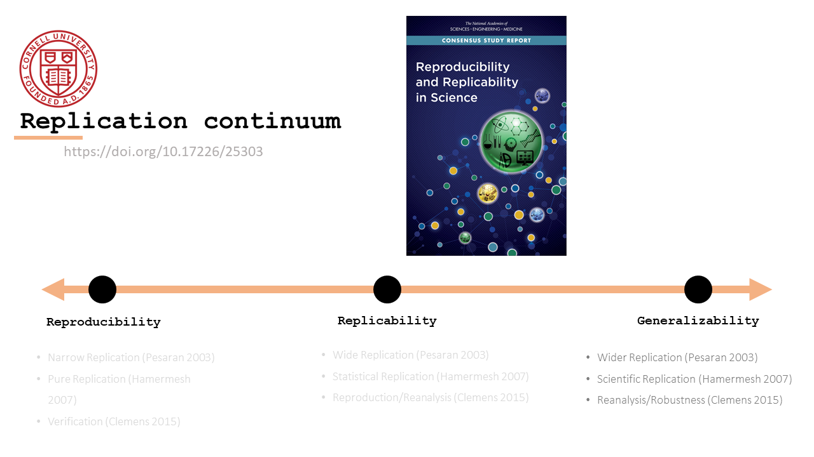
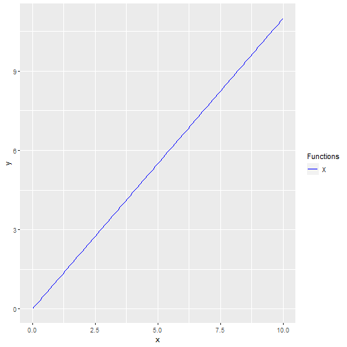
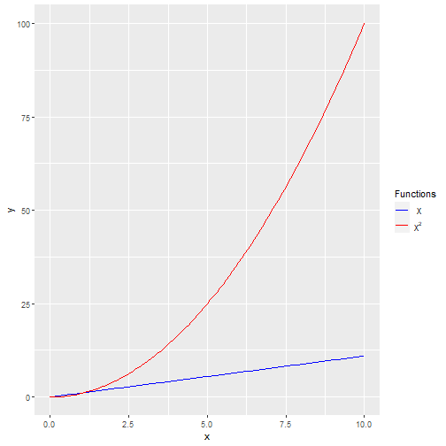
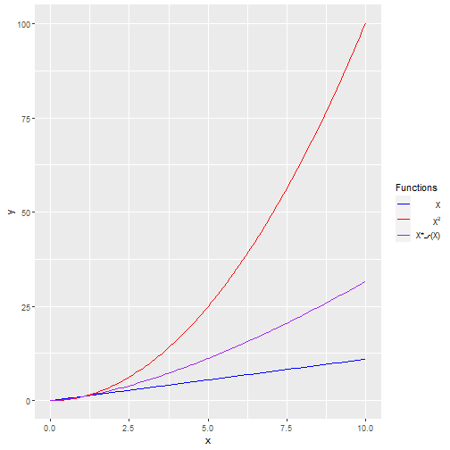
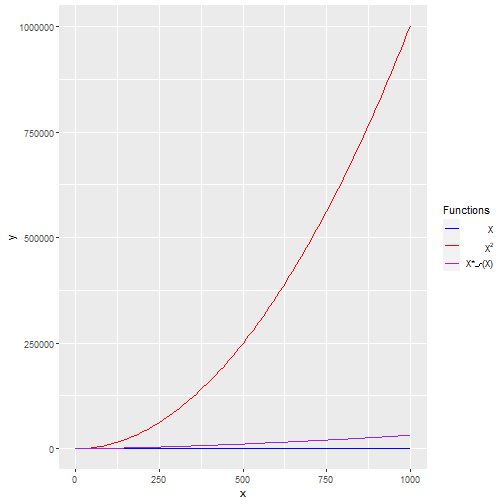

Intro
========================================================
transition: fade
author: Lars Vilhuber
date: 2020-08-24
autosize: true
width: 1440

Computing in social science research
========================================================

High performance
----
may be optional

***

Reproducible
----
should never be

Defining reproducibility
========================
= replicable/ robust/ transparent/ generalizable

Defining reproducibility
========================
= replicable/ robust/ transparent/ generalizable

- A formal definition 
- For now: __Robustness__
  - can run anywhere
  - can run without manual intervention
  - can run without deep knowledge of what is happening
  - has everything that is needed to run

Defining high-performance computing
===================================
- Requires more than your laptop
  - memory (4GB -> 4TB?)
  - CPUs (4 cores -> 1000s? millions?)
  - storage (200kB -> 200TB?)
  
Solutions for high-performance computing
========================================
- have a LAN Party
- buy a bigger laptop
- buy a bigger computer
- build your own computer
- University services
- National Research services
- Global (commercial) services (not all are legal...)

Connection between reproducibility and HPC
=========================================
- should be clear now
- your LAN party is not interested in learning your economic model - but they have the computers!
  - can run on everybody's computer
  - does not require manual intervention 
  - does not require knowledge of what's happening

Moving to third-party services 
==============
- you may need to move the **code** and/or **data**
- you may need to identify the exact **code** and/or **data** needed
- how long does it run?
- how does it scale? 

Scalability
========================================================
Processing times for perfectly (or "embarassingly") parallelizable problems scale linearly: 
***

Scalability
========================================================
However, some problems scale quadratically:
***

Scalability
========================================================
So the trick is to find solutions that scale with less than quadratic increases, such as $X\sqrt(X)$:
***

Scalability
========================================================
The reason is obvious when you let this run for large numbers (precisely where this becomes salient):
***

Summary
=======
- Reproducibility and High-performance computing have a lot of overlap
- we will discuss elements of both over the next three days

***

